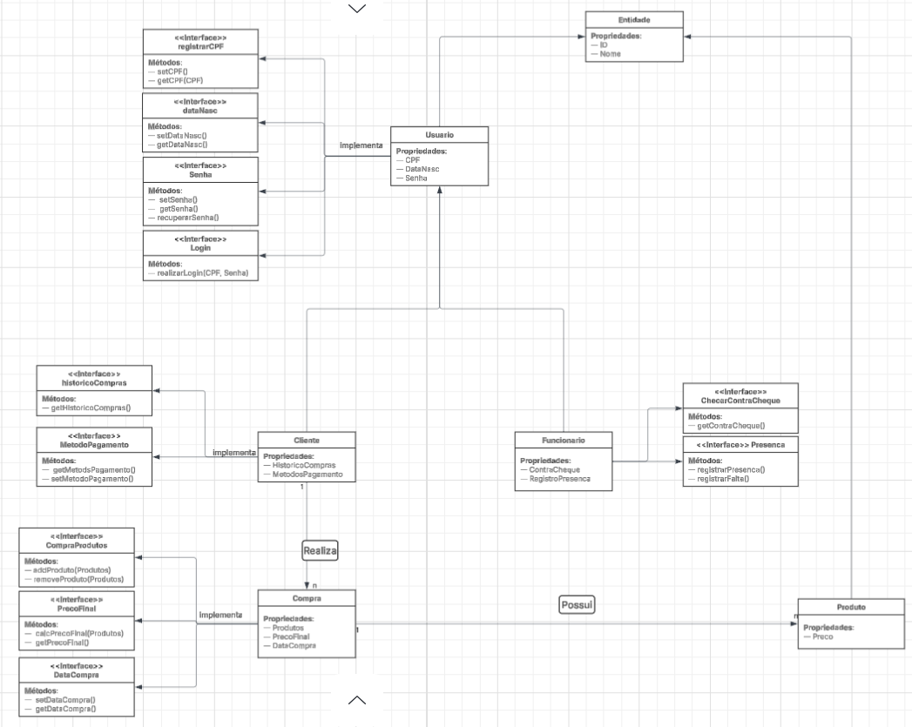

Um sistema de loja de jogos, no qual um cliente realiza uma compra, inclui os produtos e realiza o pagamente. Os funcionários se encarregam de administrar o estoque e registrar novos produtos. 

Implementação do SOLID:

Single Responsability: As classes possuem a única função de armazenar suas respectivas propriedades

Open-Close: Os métodos das classes estão em interfaces dedicadas, logo, não havendo necessidade de alteração das classes em si. Mas estando aberta par a implementação de novas interfaces

LSP: As classes derivam de abstrações, por exemplo, Entidade -> Usuário -> Cliente, etc. Uma entidade se torna um usuário que se torna um cliente, sem haver qualquer alteração no funcionamento do código. Portanto, seguindo o princípio LSP.

ISP: Cada propriedade das classes possuem uma interface dedicada apenas aos métodos referentes a uma propriedade específica, reduzindo drasticamente a possibilidade dos métodos implementados na interface ficarem em desuso.

DIP: As classes se encontram bem mais dependentes de abstrações (interfaces) que de outras classes concretas. Respeitando o DIP.
