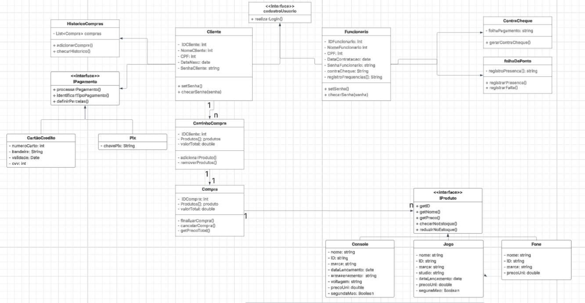
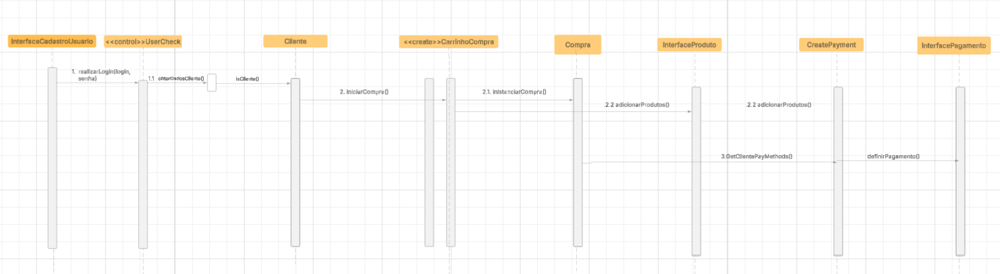

Um sistema de loja de jogos, no qual um cliente realiza uma compra, inclui os produtos e realiza o pagamente. Os funcionários se encarregam de administrar o estoque e registrar novos produtos. 

(Professor, não consegui implementar as retas tracejadas com o triângulo branco na hora de atribuir as setas das interfaces, como o senhor tinha mencionado anteriormente, não sei se é coisa do Lucidchart.)

Princípios GRASP:

O diagrama abaixo, segue os seguintes princípios do GRASP

— InformationExpert: As classes somente executam as funções as quais possuem os atributos necessários para executá-las.

— High Coesion: Todas as classes possuem responsabilidades bem definidas (Ex: Ao invés da classe cliente realizar carregar o histórico de compras e os métodos de pagamento, existem classes definidas especificamente para realizar essas funções).

— Low Coupling: As classes principais do diagrama apresentam pouca dependência entre si, por exemplo, Cliente não está diretamente associado a Compra, mas por uam classe criadora, e a compra depende de uma interface Produto, não de uma classe concreta.

— Polymorphism: Atribui interfaces para tratar objetos com diferentes comportamentos (Ex: Instancia a interface metodosPagamento, definindo o contrato "básico" que todo método de pagamento deve seguir e, a partir daí, implementa diferentes métodos como Cartão de Crédito e Pix)

— Creator: São utilizadas classes criadoras para instanciar novas classes, por exemplo, CarrinhoCompra instancia Compra, CreatePayment é responsável por instanciar os métodos de pagamento.

— Controller: Uso da classe UserCheck para checar se o usuário o qual está logando é um Cliente ou um Funcionário.

Aqui está um diagrama sequencial para o caso de uso de um Cliente realizando uma compra.

— Controller: Define se um usuário irá logar como Cliente ou Funcionário através de uma classe controladora UserCheck.

